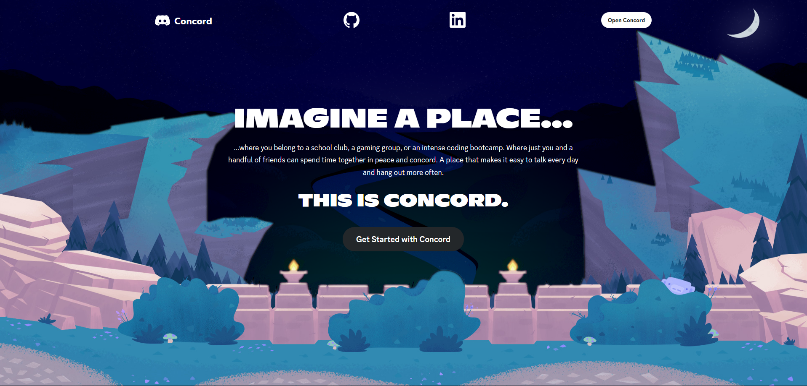
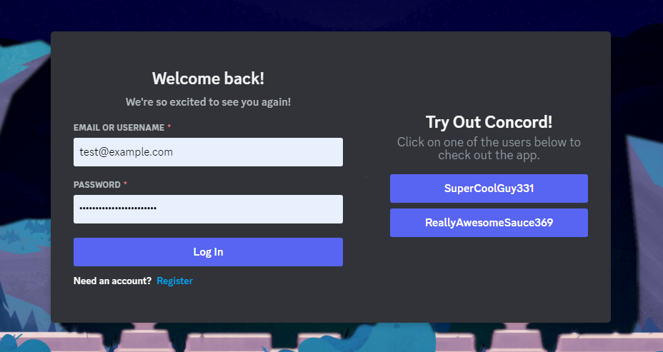

# Concord

### [Live Demo](https://concord-dn4r.onrender.com/)

Concord is a Discord clone built using React in the front-end and Rails in the backend. It provides a platform for users to communicate via servers, channels, and messages, with full CRUD functionality for each component.

You can click the Live Demo link to be redirected to a working version of this project. There will be two buttons on the Splash page that will redirect you to the Login/Register page (Get Started With Concord, Login). From there, you can choose to login, register, or use one of the two demo accounts to explore further.

## Features

To get started, users must be signed in. You can get started as one of two demo users!

1. **Servers:** On the home page, users will be presented with a list of servers they own or are members of. By clicking the green "+" icon, users can create new servers and assign unique names to them. Server management options, such as editing or deleting, are accessible to server owners via the server's dropdown menu. Additionally, users have the ability to invite others to become members of these servers.

<!--  -->

2. **Channels:** Every server includes a default #general channel, where users can exchange messages and interact. Server owners can add new text channels by clicking on "TEXT CHANNELS +". Hovering over a channel name displays two icons, enabling users to edit the channel's name and delete any channel except for the #general channel.

<!--  -->

3. **Messages w/ WebSockets:** All users that are members of a server will have the option to send messages inside it's text channels, taking advantage of WebSockets which allows users to communicate in real time. Users can also see two icons when hovering their own messages. These icons give users the ability to edit and delete their messages. When sending messages, users can fill in the text field that lives at the bottom of the screen and press "Enter" to send.

### Future Implementations
- Ability to add and delete friends
- Direct-messaging between friends
- Ability to invite other members to a server
